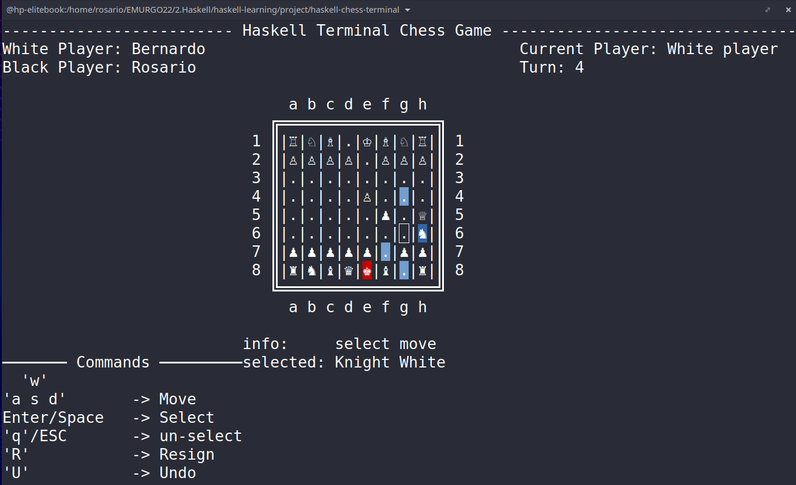

# haskell-chess-terminal-game

Project developed in the context of *Emurgo's Cardano Developer Associate Programme*. This is my final project of the *Haskell Programming* module that aims at demonstrating haskell basic profeciency

# Intro

This is a simple chess terminal game that contains all basic chess rules including special moves: *Castling, Enpassant and pawn Promotion*. 
(Pawns are promoted to Queen by default)

Once the game is running the board is displayed on the terminal and you can use "wasd" to move the cursor to select pieces and movement

## Game Features

Short list of features included:
1. When piece selected it highlights its possible moves
2. When in check the King is highlighted
3. Check-mate is declared and the game terminates when there is no possible move to take the king out of check 
4. Option to resign
5. Option to rewind to previous turn 

# Getting Started 
Repo contains all the necessary sources to build and run it on your terminal 

Instructions assuming cabal is installed:
1. git clone git@github.com:rosadorio/haskell-chess-terminal.git
2. cd haskell-chess-terminar
3. cabal update && cabal install --only-dependencies
4. cabal build
5. cabal run

